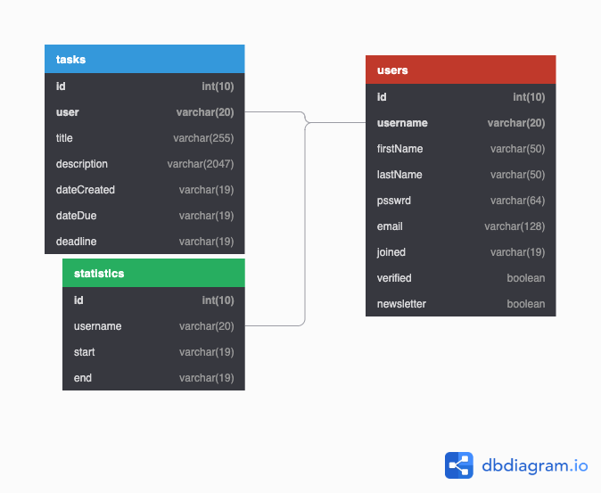

# helix2

a project including mainly 3 things:

- a base program to write/change etc tasks to a database (also users)
- a cli to access the base
- a webserver for API-requests and to host the web interface

## DB-Setup



Or in SQL:

```sql
CREATE TABLE `tasks` (
  `id` int(10) UNIQUE NOT NULL AUTO_INCREMENT,
  `user` varchar(20) NOT NULL,
  `title` varchar(255),
  `description` varchar(2047),
  `dateCreated` varchar(19) NOT NULL,
  `dateDue` varchar(19),
  `deadline` varchar(19),
  PRIMARY KEY (`id`, `user`)
);

CREATE TABLE `users` (
  `id` int(10) UNIQUE NOT NULL AUTO_INCREMENT,
  `username` varchar(20) UNIQUE NOT NULL,
  `firstName` varchar(50),
  `lastName` varchar(50),
  `psswrd` varchar(64) NOT NULL,
  `email` varchar(128) UNIQUE NOT NULL,
  `joined` varchar(19) NOT NULL,
  `verified` boolean NOT NULL,
  `newsletter` boolean NOT NULL,
  PRIMARY KEY (`id`, `username`)
);

CREATE TABLE `statistics` (
  `id` int(10) UNIQUE PRIMARY KEY NOT NULL AUTO_INCREMENT,
  `username` varchar(20) NOT NULL,
  `start` varchar(19) NOT NULL,
  `end` varchar(19) NOT NULL
);

CREATE TABLE `tests` (
  `id` int(10) PRIMARY KEY NOT NULL AUTO_INCREMENT,
  `key` varchar(20) NOT NULL,
  `value` varchar(20)
);

ALTER TABLE `tasks` ADD FOREIGN KEY (`user`) REFERENCES `users` (`username`);

ALTER TABLE `statistics` ADD FOREIGN KEY (`username`) REFERENCES `users` (`username`);
```

## API (POST endpoints) overview

parameters are required, _parameters_ optional

| API endpoint                | description                                     | parameters                                                                                                                                                                                             |
| --------------------------- | ----------------------------------------------- | ------------------------------------------------------------------------------------------------------------------------------------------------------------------------------------------------------ |
| /api/register               | registers new users                             | username, firstName, lastName, password, email                                                                                                                                                         |
| /api/login                  | user login                                      | username, password                                                                                                                                                                                     |
| /api/getuser                | get user information                            | username, password                                                                                                                                                                                     |
| /api/changeuser             | change user settings                            | username, password, _newUsername_, _firstName_, _lastName_, _newPassword_, _email_                                                                                                                     |
| /api/deleteuser             | delete user                                     | username, password                                                                                                                                                                                     |
| /api/gettasks               | return tasks matching query                     | username, password, _getAll: bool_, _id: list[integer]_, _general: str_, _precise: bool_, _title_, _description_, _dateCreated: str(isoformat)_, _dueDate: str(isoformat), \_deadline: str(isoformat)_ |
| /api/addtask                | add new task                                    | username, password, _title_, _description_, _dueDate: str(isoformat)_, _deadline: str(isoformat)_                                                                                                      |
| /api/changetask             | change task                                     | username, password, id, _title_, _description_, _dueDate_, _deadline_                                                                                                                                  |
| /api/deletetask             | delete task                                     | username, password, id                                                                                                                                                                                 |
| /api/resettasks             | delete all tasks from user                      | username, password                                                                                                                                                                                     |
| /api/requestdata            | request personal data for user (sent via email) | username, password                                                                                                                                                                                     |
| /api/statistics/sayhello    | report that user is active                      | username, password                                                                                                                                                                                     |
| /api/statistics/getsessions | get all sessions of user                        | username, password                                                                                                                                                                                     |
| /api/newsletter/subscribe   |  subscribe to newsletter                        |  username, password                                                                                                                                                                                    |
| /api/newsletter/unsubscribe |  unsubscribe from newsletter                    |  username                                                                                                                                                                                              |
